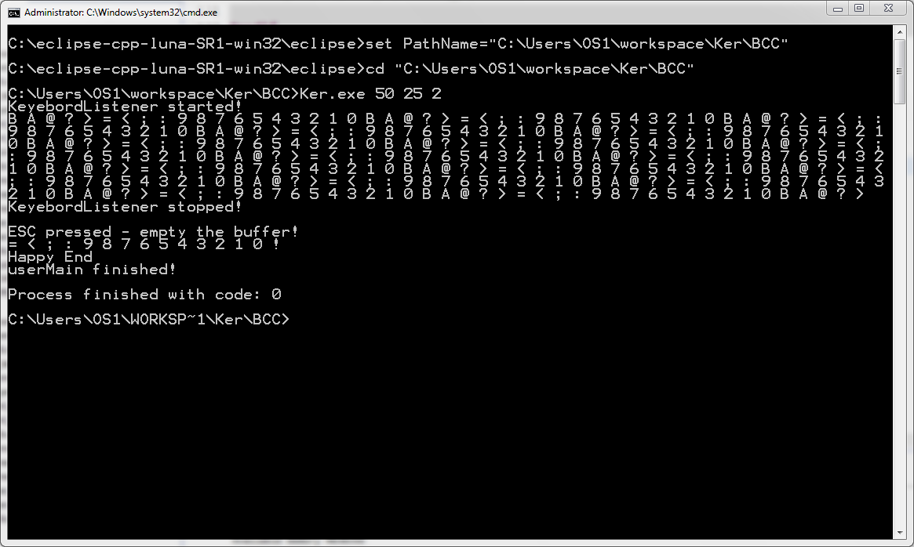

# Kernel
Implementation of a small, but completely functional operating system kernel. Supports concepts such as multithreading, time sharing, semaphores, events and asynchronous signals.

The kernel is implemented so the user application and the kernel itself share the same address space. In other words, they are a part of a single program. Concurrent processes created within the application are actually lightweight processes (threads). The application and the kernel are compiled and linked together to produce a single executable program. I.e. they are written as a unique source code.

Within this project, a special subsystem of the kernel is implemented - the thread management subsystem. This subsystem implements the concept of threads (as well as the services for creating and running threads), the concept of semaphores and events triggered by interrupts, and it provides the support for time sharing.

To test the behaviour of the kernel, as well as its efficiency and performance, a well-known example is provided - the bounded buffer problem. It is given as a system of a few producers and one consumer which exchange data using the bounded buffer. The producers and the consumer are all implemented as threads while the buffer is a passive object which uses semaphores for mutual exclusion and conditional synchronization. The type of data that is individually being written to and read from the buffer is a single character. There is also one special producer which is activated with interruption caused by pressing the keyboard, reads the pressed key and puts the matching character into the buffer.

For the purpose of demonstration, easier development, testing and experimenting, the kernel and the application need to be executed on any type of 32-bit Windows operating system like a console application.

-----------------------------------------------------------------------------------------------------------------------------------------------------------------------------------

Screenshot:

